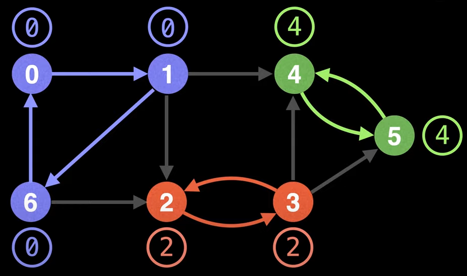

# Strongly Connected Components (SCC)

## 1. What are SCCs?
- Strongly Connected Components (SCC) are self-contained cycles within a directed graph where every vertex in a given cycle can reach every other vertex in the same cycle. 
- In other words, **if there is a path between all pairs of vertices**, the directed graph is called *strongly connected*.

## 2. Low-Link Values
- The low-link value of a node is the smallest [lowest] node id reachable from that node when doing a DFS.



- Notice: For each SCC, all the lowest low-link values are the same. 
    - BUT: It is highly dependent on the traversal order of the DFS.

## 3. Tarjan's algorithm
- To deal with the above problem, Tarjan's algorithm maintains a set (often implemented as a stack) of valid nodes from which to update low-link values from.
- Nodes are added to the stack [set] of valid nodes as they are explored for the first time.
- Nodes are removed from the stack [set] each time a SCC is found.
### New low-link update condition:
- If `u` and `v` are nodes in a graph and we're currently exploring `u`:
    - To update node `u`'s low-link value to node `v`'s low-link value, there has to be a path of egdes from `u` to `v` and node **`v` must be on the stack**.

### Tarjan's algorithm in a nutshell
- Mark the id of each node as unvisited.
- Start DFS. Upon visiting a node, assign it an `id` and a low-link value (equals to its `id`). Mark the current nodes as visited and add them to the stack.
- On DFS callback, if the previous node is on the stack, then min the current node's low-link value with the last node's low-link value.
- After visiting all neighbors, if the current node started a connected component(*) then pop nodes off the stack until the current node is visited.
    - (*): A node starts a connected component if its `id` equals its low-link value.

## 4. Pseudo-code

```
UNVISITED = -1
n = number of nodes in graph
g = adjacency list with directed edges

id = 0          # assign an id for each node
scc_count = 0   # count the number of SCCs found

ids = [0] * n
low = [0] * n
on_stack = [False] * n
stack = []      # an empty stack data structure

function find_scc():
    for i = 0, i < n, i++: ids[i] = UNVISITED
    for i = 0, i < n, i++:
        if (ids[i] == UNVISITED):
            dfs(i)

    return low

function dfs(int node):
    stack.push(node)
    on_stack[node] = True
    ids[node] = low[idx] = id++

    # visited all the neighbors & low-link assign on callback
    for next_node : g[node]:
        if ids[next_node] == UNVISITED:
            dfs(node)

        if on_stack[next_node]:
            low[node] = min(low[node], low[next_node])
    
    # pop the stack if the current node is the start of the SCCs components
    if ids[node] == low[node]:
        while pop_node = stack.pop() != node:
            on_stack[pop_node] = False
            low[pop_node] = ids[node]
        
        scc_count ++
```

